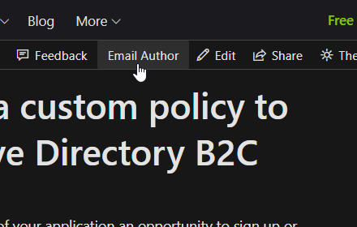
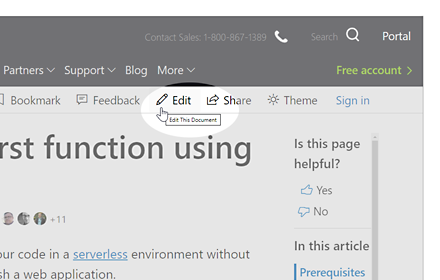
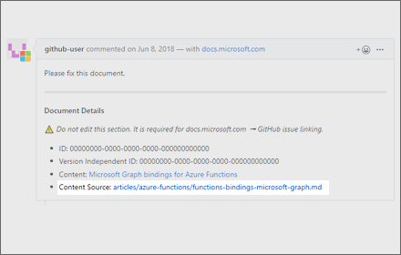

A browser extension that fosters collaboration and makes it easy to edit Microsoft docs.

## Features

When working with Microsoft docs in the browser, you can open an editor in the private repository for quick edits and collaboration.

## Installation

Install via the [Google web store](https://chrome.google.com/webstore/detail/spineedit/llhlgkbkfdfcbjbfnnakfpgmemopbbnf).

## Usage

After installation of the chrome extension, you will be ableto easily email the author of an Azure Document by clicking the Email Author button per below. 

| Website | Click on the... | |
|---------|-----------------| --- |
| docs.microsoft.com | *Email Author* button | |

> **NOTE** Workflows below only work if you have access to the destination repository.

When you attempt to edit an article:

1. GitHub's page editor is opened
1. The commit description is pre-populated with the article author's GitHub username

| Website | Click on the... | |
|---------|-----------------| --- |
| docs.microsoft.com | *Edit* button | |
| github.com | _Content Source_ link in an article issue | |

## Known issues

- When opening links from *github.com/issues* the *Content Source* link doesn't open in a new tab

## Test plan

- Open an [article](https://docs.microsoft.com/en-us/azure/azure-functions/functions-create-your-first-function-visual-studio) on *docs.microsoft.com*:
  - Click on the **Edit** button
  - Click on the **Email Author**  button

- On *github.com*, open links using left and right-clicks, then click on the **Content Source** link:
  - [github.com/issues/assigned](https://github.com/issues/assigned)
  - [github.com/MicrosoftDocs/azure-docs/issues](https://github.com/MicrosoftDocs/azure-docs/issues)

## Acknowledgements

Created by [Craig Shoemaker](https://github.com/craigshoemaker) and [Frank Hu](https://github.com/frankhu-msft).

Thanks to [Erika Doyle](https://github.com/erikadoyle) and [John Papa](https://github.com/johnpapa) for feedback and suggestions.
